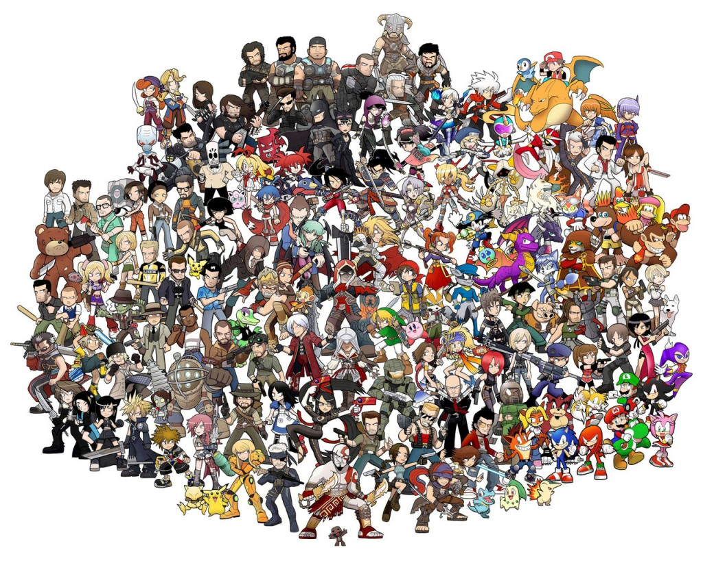

# EDA - Video Games Analysis

*Video Pames Popularity, Sales and Scores For Each Generation (carried out in July 2024)*

## Dataset

Link to the Dataset : https://www.vgchartz.com

Source : https://www.kaggle.com/datasets/asaniczka/video-game-sales-2024?resource=download

## Content

14 columns :

- img - Boxart of the game

- Title - The games name

- Console - Platform of the games release (i.e. PC, PS5, NS, etc.)

- Genre - Genre of the game

- Publisher - Publisher of the game

- Developer - Developer of the game

- Critic_score - Critic score of the game

- Total_sales - Total worldwide sales

- NA_Sales - Sales in North America (in millions)

- Pal_Sales - Sales in Europe (in millions)

- JP_Sales - Sales in Japan (in millions)

- Other_Sales - Sales in the rest of the world (in millions)

- Release_date : Release date of the game

- Last_update : Last update.

