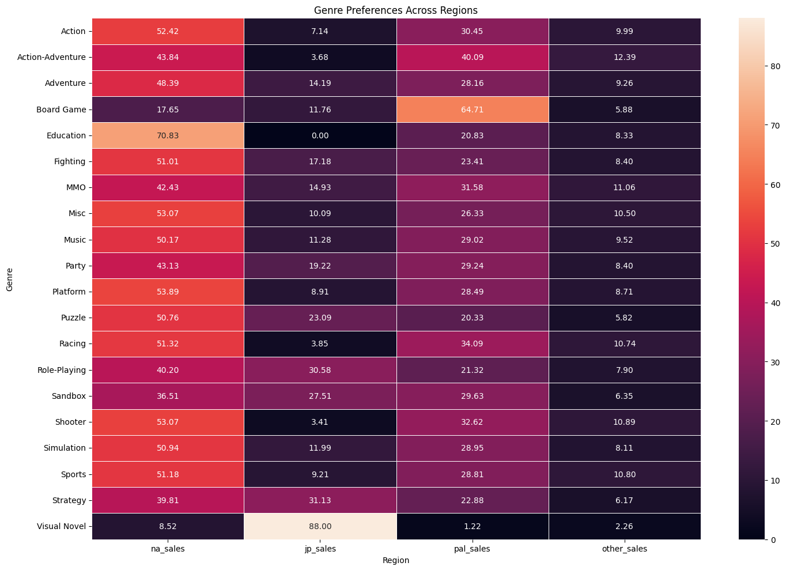

# EDA - Video Games Analysis

*Video Games Popularity, Sales and Scores For Each Generation (carried out in July 2024)*

## Dataset

Link to the Dataset : https://www.vgchartz.com

Source : https://www.kaggle.com/datasets/asaniczka/video-game-sales-2024?resource=download

/!\ Warning /!\

Pay attention to the methodology for collecting data : https://www.vgchartz.com/methodology.php

"Since the end of 2018 VGChartz no longer produces estimates for software sales. This is because the high digital market share for software was making it both more difficult to produce reliable retail estimates and also making those estimates increasingly unrepresentative of the wider performance of the games in question. As a result, on the software front we now only record official shipment/sales data, where such data is made available by developers and publishers. The legacy data remains on the site for those who are interested in browsing through it."

Full text here : https://www.vgchartz.com/methodology.php

## Content

14 columns :

- img - Boxart of the game

- Title - The games name

- Console - Platform of the games release (i.e. PC, PS5, NS, etc.)

- Genre - Genre of the game

- Publisher - Publisher of the game

- Developer - Developer of the game

- Critic_score - Critic score of the game

- Total_sales - Total worldwide sales

- NA_Sales - Sales in North America (in millions)

- Pal_Sales - Sales in Europe (in millions)

- JP_Sales - Sales in Japan (in millions)

- Other_Sales - Sales in the rest of the world (in millions)

- Release_date : Release date of the game

- Last_update : Last update.

## Content

- 14 columns
- 64 016 rows

## Overview

Welcome to my Video Games Project! 

The purpose of this analysis is to reveal which games are the most popular, the most sales.

The aim of this analysis is to reveal which games are the most popular, the best-selling and the best-rated, by generation (3rd - 9th).

## Project highlights

📌 **Data Preparation:** Rigorously cleaned and prepared the dataset, ensuring data quality and integrity for robust analysis.

📌 **Initial Exploration:** Engaged in initial data exploration during EDA to gain a deep understanding of variables and distributions.

📌 **Data Cleaning:** Employed advanced data cleaning techniques to handle missing values, outliers, and inconsistencies, ensuring accuracy in analysis.

📌 **Data Visualization:** Utilized Matplotlib and Seaborn to create compelling visualizations, revealing trends in this dataset.

📌 **Meaningful Conclusions:** Derived insights to shed light on artist popularity, scores, sales and correlations between variables.

## Insights

Here are the 20 best-selling games according to this dataset:

")

Note the absence of games like Wii Sports, which I thought would appear in this ranking. Stange...

📌 By Genre :

- Misc is the genre with the most games released (9304)
- Sports (1187 millions) and Action (1125 millions) are the genre with the most sales
- Sandbox is the genre with the best critic score (9,20)

📌 By Publisher :

- The vast majority of publishers are unknown (8842!). Sega (2207) and Ubisoft (1663) are 2nd and 3rd
- Activision (722 millions) and EA (644 millions) are the publishers with the most sales. They are very big in this industry.
- Toby Fox *(Undertale)* is the publisher with the best critic score (9,70)
 
📌 By Region :

- There are four regions in this dataset.

- Sandbox is the genre with the most sales, all regions combined
- Genre Preferences Across Regions:

